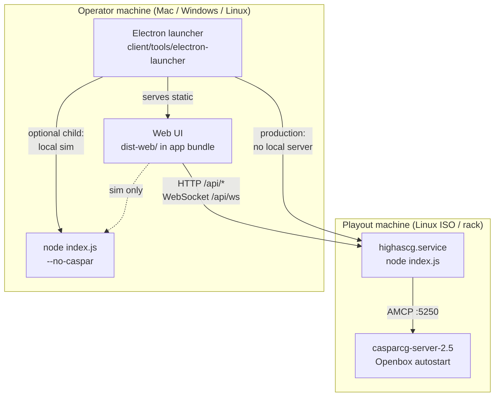

# Plan: Permanent server / client split

**Status:** Phase 3–4 complete (server/client split shipped)  
**Goal:** One canonical model everywhere: **Node server = API + Caspar orchestration only**; **client = static Web UI hosted by the Electron launcher** (operator workstation). Playout ISO and exFAT drops carry **server only**.

**Related:** [`work/BACKEND_AND_CLIENT_SPLIT.md`](../work/BACKEND_AND_CLIENT_SPLIT.md), WO‑51 [`work/work-orders/51_WO_DECOUPLED_FRONTEND_BACKEND_ARCHITECTURE.md`](../work/work-orders/51_WO_DECOUPLED_FRONTEND_ARCHITECTURE.md), [`docs/WO47_ISO_VS_EXFAT.md`](WO47_ISO_VS_EXFAT.md), [`client/tools/electron-launcher/`](../../client/tools/electron-launcher/).

---

## 1. Target architecture



| Role | Process | Hosts | Does **not** do |
|------|---------|-------|------------------|
| **Server** | `node index.js` (`highascg.service` on playout) | REST `/api/*`, WS `/api/ws`, `/templates/*`, `/vendor/*` (npm ESM for previs/CG studio) | Serve `dist-web/`, `client/`, or operator HTML |
| **Client** | Static SPA inside **Electron** (or Vite dev server) | Operator UI, scene editor, settings forms | AMCP, Caspar XML generation, OSC UDP, systemd, GPU layout |
| **Launcher** | Electron `main.js` | Stick prep UI, sim controls, **embedded `dist-web/`**, API base configuration | Playout (except optional local sim child) |

**Connection rule:** The browser/Electron renderer always knows **`HIGHASCG_API_ORIGIN`** (e.g. `http://192.168.0.42:4200`). All API, WS, `/templates/`, and `/vendor/` URLs are resolved against that origin—not `location.origin` of the UI page.

---

## 2. Why (decision record)

| Concern | Same-origin server UI | Split (this plan) |
|---------|----------------------|-------------------|
| GPU on playout | Browser + Caspar compete | Caspar-only on playout |
| ISO size | `dist-web/` + `node_modules` bloat | Server tarball only |
| Update cadence | Reflash ISO for UI tweaks | Client release without touching playout |
| Operator workflow | Keyboard/mouse on playout head | Control from laptop (Electron) |
| Security | Wide HTTP static surface on playout | API surface only (`HIGHASCG_HEADLESS`) |

WO‑47 **exFAT `update/server/`** already assumes server-only drops; this plan makes **headless the default on ISO** and moves UI hosting into **Electron** instead of “open browser to playout :8080”.

---

## 3. Environment and configuration matrix

### 3.1 Server (playout + sim child process)

| Variable | Where set | Values | Effect |
|----------|-----------|--------|--------|
| **`HIGHASCG_HEADLESS`** | **Required** on playout: systemd drop-in `/etc/systemd/system/highascg.service.d/10-headless.conf` | `true` \| `1` \| `yes` (normalize in code) | Non-API HTTP → 404 JSON; no `serveWebApp` |
| **`NODE_ENV`** | systemd | `production` | Standard Node |
| **`HTTP_PORT`** / **`PORT`** | systemd / `config/server.json` | default **`4200`** (`src/config/defaults.js`) | API listen port |
| **`BIND_ADDRESS`** | systemd / config | `0.0.0.0` on playout | API bind |
| **`WS_PORT`** | config (future split) | today same as HTTP | Reserved WO‑51 |
| **`HIGHASCG_CONFIG_PATH`** | optional | path to monolithic JSON | Overrides modular `config/` |
| **`HIGHASCG_EXFAT_SYNC_MAP`** | `/etc/highascg/exfat-sync.json` | path | WO‑47 sync |
| **`CASPAR_CONFIG_PATH`** | rare override | path | Caspar XML path |
| **`HIGHASCG_WS_*`**, **`HIGHASCG_OSC_*`**, etc. | env | see README | Unchanged |

**Remove / deprecate on server:**

| Variable | Action |
|----------|--------|
| **`HIGHASCG_WEB_DIR`** | Deprecate; ignored when `HIGHASCG_HEADLESS` (eventually delete `resolveWebDir` from `index.js`) |
| **`HIGHASCG_ISO_BUILD_WEB`** | Remove from `install-iso-defaults.sh` after split (no `dist-web` on ISO) |
| Default **`HIGHASCG_ISO_EMBED_SERVER=1`** | Keep embedding **`src/`**, **`node_modules/`**, **`package.json`**; never embed **`dist-web/`** |

**systemd (playout) — new drop-in:**

```ini
# /etc/systemd/system/highascg.service.d/10-headless.conf
[Service]
Environment=HIGHASCG_HEADLESS=true
```

Update **`scripts/write-highascg-systemd-unit.sh`** to install this drop-in by default.

### 3.2 Client (Vite build + Electron)

| Variable | Where set | Purpose |
|----------|-----------|---------|
| **`VITE_HIGHASCG_API_ORIGIN`** | `.env.production`, Electron build, CI | Build-time default API origin (e.g. `http://127.0.0.1:4200`) |
| **`window.__HIGHASCG_API_ORIGIN__`** | Electron `preload.js` at runtime | **Overrides** Vite default when operator sets “Server IP” |
| **`VITE_HIGHASCG_WS_ORIGIN`** | optional | Explicit WS origin if ever split from HTTP |

**New module:** `client/lib/api-origin.js` (single source of truth):

```js
// Pseudocode — implement in Phase 2
export function getApiOrigin() {
  const runtime = globalThis.__HIGHASCG_API_ORIGIN__
  if (runtime) return String(runtime).replace(/\/$/, '')
  const built = import.meta.env.VITE_HIGHASCG_API_ORIGIN
  if (built) return String(built).replace(/\/$/, '')
  return '' // '' => legacy same-origin relative /api (dev only)
}
export function getApiBase() { /* Companion /instance/ prefix on pathname OR api origin */ }
export function getWsUrl() { /* ws(s) from getApiOrigin() + /api/ws */ }
export function assetUrl(path) { /* getApiOrigin() + /vendor/... /templates/... */ }
```

Refactor **`client/lib/api-client.js`** and **`client/lib/ws-client.js`** to use `api-origin.js`.

**Electron launcher (`client/tools/electron-launcher/`):**

| Variable | Set by | Purpose |
|----------|--------|---------|
| **`HIGHASCG_API_ORIGIN`** | main → preload → renderer | Target playout API (production connect) |
| **`HIGHASCG_UI_ROOT`** | main (packaged `dist-web/`) | Path to static UI inside `.asar` / `resources/` |
| **`HIGHASCG_LAUNCH_MODE`** | main | `connect` \| `sim` \| `prep-only` |
| **`HIGHASCG_LAUNCH_NO_BROWSER`** | main | `1` — Electron hosts UI; do not `xdg-open` |
| **`HIGHASCG_OFFLINE_MODE`** | sim only | passed to child `index.js` |
| **`HTTP_PORT`** | sim child env | local headless server port |

**Deprecate for production UI path:**

| Variable | Action |
|----------|--------|
| Opening external browser to `http://{ip}:{port}/` | Replace with **Electron `BrowserWindow`** loading packaged UI + `HIGHASCG_API_ORIGIN` |

### 3.3 Dev workstation (repo checkout)

| Workflow | Server | Client UI |
|----------|--------|-----------|
| **Split dev (canonical)** | `HIGHASCG_HEADLESS=true npm start` | `npm run dev:client` (Vite `:3000`) |
| **Vite proxy** | Fix **`vite.config.js`** proxy target → **`http://localhost:4200`** (today wrongly `8000`) | Proxies `/api`, `/ws`, `/vendor`, `/templates` |
| **Legacy monolith** | `npm start` without headless | Same port serves UI — **dev-only**, document as deprecated |

### 3.4 CORS (server)

Today: `Access-Control-Allow-Origin: *` in `src/server/cors.js`.

| Variable | Purpose |
|----------|---------|
| **`HIGHASCG_CORS_ORIGINS`** | Comma-separated allowed origins (e.g. `http://127.0.0.1:3000,file://,app://`) |
| Default when headless | `http://localhost:3000`, Electron `file://` / custom protocol |

Required once UI origin ≠ API origin.

---

## 4. Path and artifact layout (canonical)

### 4.1 Repository (development)

| Path | Role after split |
|------|------------------|
| `index.js`, `src/` | Server only |
| `package.json` (root) | Server deps + Vite **devDependencies** |
| `client/` | UI sources |
| `dist-web/` | Vite output — **client artifact**, packaged into Electron, **not** deployed to playout |
| `config/casparcg.config.iso` | ISO Caspar default (unchanged) |
| `tools/runtime/` | On playout via server tarball |
| `tools/eggs/` | Build host only |
| `client/tools/electron-launcher/` | Operator app + **bundled `dist-web/`** |

### 4.2 Playout machine (`/home/casparcg/highascg`)

| Path | On ISO / after install |
|------|------------------------|
| `index.js`, `src/`, `scripts/`, `tools/runtime/`, `node_modules/`, `package.json` | Yes (embed or exFAT `update/server/`) |
| `config/casparcg.config` | Yes (from `casparcg.config.iso` on prepare) |
| `template/`, `lib/`, `media/`, stubs | Yes |
| `dist-web/`, `client/` | **No** |
| `highascg.service` + `10-headless.conf` | Yes |

### 4.3 exFAT stick (`HIGHASCGEXF`)

| Path | Contents |
|------|----------|
| `update/server/` | `highascg-server_*.tar.gz` extract — **backend only** |
| `sim/highascg/` | **Deprecated for Linux playout**; optional Win/Mac legacy sim tree (server only, no UI) |
| `media/`, `templates/`, `configs/`, `drop-config/` | Unchanged |

**Client on stick:** Not required if Electron ships UI. Optional future: `sim/client/dist-web/` for air-gapped extract-only workflows.

### 4.4 GitHub releases

| Script | Artifact | Contents |
|--------|----------|----------|
| `npm run release:github-server` | `highascg-server_*.tar.gz` | `index.js`, `src/`, `scripts/`, `tools/runtime/`, `config/`, `package.json`, `node_modules/` (optional) — **no `dist-web/`** |
| `npm run release:github-client` | `highascg-client_*.tar.gz` | `dist-web/` only |
| **New:** `npm run release:launcher` (TBD) | `HighAsCG-Launcher_*.{dmg,exe,AppImage}` | Electron + embedded `dist-web/` + version pin file |

### 4.5 Eggs / ISO excludes (after split)

Use **`penguins-eggs-exclude-highascg-fragment.list`** (WO‑47 server omit) **plus** always exclude:

```
home/casparcg/highascg/dist-web
home/casparcg/highascg/dist-web/*
```

Revert default **`HIGHASCG_ISO_EMBED_SERVER`** to embed **server only** (no `npm run build:client` in `install-iso-defaults.sh`).

---

## 5. Electron launcher design (UI host)

### 5.1 Process model

| Mode | Child processes | UI window |
|------|-----------------|-----------|
| **Connect to playout** | None (or optional health-ping script) | `BrowserWindow` → `file://` / `app://` bundled `dist-web/index.html` with `preload` setting `__HIGHASCG_API_ORIGIN__` = `http://{Server IP}:{port}` |
| **Local simulation** | `node launch-sim-from-exfat.js` (headless server on laptop) | Same window; API origin `http://127.0.0.1:{simPort}` |
| **Prep / flash tabs** | None | Existing launcher chrome only |

**Remove:** `btn-open-webui` → external system browser for production path (keep as advanced fallback behind “Open in browser”).

### 5.2 Packaging layout (Electron builder)

```
HighAsCG-Launcher.app/
  resources/
    app/dist-web/          # from npm run build:client
    app/preload.js         # sets __HIGHASCG_API_ORIGIN__
    server-stub/           # optional: pin compatible server version text only
```

**Do not** bundle full `node_modules` for playout server inside Electron (size, duplication). Sim mode spawns server from `sim/highascg` on stick or dev repo.

### 5.3 UI ↔ API wiring

1. Operator enters **Server IP** + **port** (default **4200**, not 8080 — align docs).
2. On **Connect**, main process stores `HIGHASCG_API_ORIGIN`, opens app window, preload injects origin.
3. Renderer `fetch(getApiOrigin() + '/api/state')`, `new WebSocket(getWsUrl())`.
4. **Import map** in `client/index.html` must use **runtime-generated** vendor URLs:

```html
<!-- Today (same-origin only): -->
"three": "/vendor/three/build/three.module.js"
<!-- After split: generated at load from getApiOrigin() + '/vendor/three/...' -->
```

Implement via small inline script in `index.html` or Vite plugin `transformIndexHtml`.

### 5.4 Files to change (launcher)

| File | Change |
|------|--------|
| `client/tools/electron-launcher/main.js` | Add `createAppWindow()`, `protocol`/`preload`, pack `dist-web` path |
| `client/tools/electron-launcher/preload.js` | **New** — expose `setApiOrigin`, read env |
| `client/tools/electron-launcher/renderer.js` | “Connect” starts app window; sim sets local origin |
| `client/tools/electron-launcher/package.json` | electron-builder config, `extraResources: dist-web` |
| `package.json` | `"launcher:package": "..."` script |

---

## 6. Server code changes

| File | Change |
|------|--------|
| `src/server/http-server.js` | Treat `HIGHASCG_HEADLESS` as true for `1`/`yes`; skip `webDir` branch entirely when headless |
| `index.js` | Do not call `resolveWebDir` when headless; log `API-only` |
| `src/repo-paths.js` | Mark `resolveWebDir` **deprecated**; dev-only guard |
| `scripts/write-highascg-systemd-unit.sh` | Write `highascg.service.d/10-headless.conf` |
| `tools/eggs/live-usb/install-iso-defaults.sh` | Remove `build:client`; only Caspar config + `npm ci --omit=dev` for server |
| `tools/eggs/live-usb/prepare-eggs-clone-with-exfat.sh` | Default `HIGHASCG_ISO_BUILD_WEB=0`; document headless |
| `tools/release/make-github-release-server.sh` | Notes: never bundle UI; require client/launcher |
| `README.md`, `docs/DEV_RELEASE_GITHUB.md`, `docs/ISO_CONTENTS.md` | Port **4200**, headless default, Electron operator path |

**Optional hardening (Phase 4):** Remove `serveWebApp` code paths behind `NODE_ENV === 'development'` flag so production builds cannot accidentally serve UI.

---

## 7. Client code changes

### 7.1 API / WS / assets (critical)

| File | Change |
|------|--------|
| **`client/lib/api-origin.js`** | **New** — `getApiOrigin`, `assetUrl` |
| `client/lib/api-client.js` | `getApiBase()` = Companion prefix **or** `${getApiOrigin()}` |
| `client/lib/ws-client.js` | `getWsUrl()` from API origin |
| `client/lib/thumbnail-url.js` | Already uses `getApiBase()` — verify after refactor |
| `client/index.html` | Dynamic import map for `/vendor/*` |
| `client/components/sources-panel-helpers.js` | Replace `location.origin` + `/templates/...` with `assetUrl('/templates/...')` |
| `client/components/publish-modal.js` | `myOrigin` → API origin for ingest preview |
| Grep targets | `/vendor/`, `/templates/`, `location.origin` in `client/` |

### 7.2 Vite

| File | Change |
|------|--------|
| `vite.config.js` | Proxy → `http://127.0.0.1:4200`; add `define` for optional env |
| `.env.development` | **New** — `VITE_HIGHASCG_API_ORIGIN=http://127.0.0.1:4200` |
| `.env.production` | **New** — empty or placeholder; Electron injects at runtime |

### 7.3 Build outputs

| Output | Consumer |
|--------|----------|
| `dist-web/` | Electron `extraResources` only |
| `highascg-client_*.tar.gz` | Manual extract / CI; optional stick `sim/client/` |

---

## 8. Cross-origin and `/vendor` / `/templates`

Caspar HTML templates and previs/CG-studio depend on server-mounted paths:

| URL (on API server) | Served by | Client must use |
|---------------------|-----------|-----------------|
| `/api/*` | `src/api/router.js` | `{API_ORIGIN}/api/...` |
| `/api/ws` | `ws-server.js` | `ws://{host}:{port}/api/ws` |
| `/templates/*` | `http-server.js` `templatesDir` | `{API_ORIGIN}/templates/...` |
| `/vendor/three/*`, `/vendor/grapesjs/*` | `vendorDirs` in `index.js` | `{API_ORIGIN}/vendor/...` |

**Smoke test (new):** Headless server + Vite dev UI on `:3000` — verify previs module loads Three from API origin.

---

## 9. Implementation phases

### Phase 0 — Docs and flags (1 day)

- [x] Accept this plan; link from `README.md`
- [x] Add `HIGHASCG_HEADLESS=true` to `write-highascg-systemd-unit.sh` drop-in on imaging host
- [x] Set `HIGHASCG_ISO_BUILD_WEB=0` default; exclude `dist-web/` from ISO embed fragment
- [x] Fix `vite.config.js` proxy ports to **4200**

### Phase 1 — API origin in client (2–3 days)

- [x] Add `client/lib/api-origin.js`
- [x] Refactor `api-client.js`, `ws-client.js`
- [x] Fix `location.origin` / `/templates` / import map (`index.html` + Vite plugin)
- [x] CORS: `HIGHASCG_CORS_ORIGINS` + default Vite origins when headless
- [x] `npm run smoke:api-origin`; split dev: `HIGHASCG_HEADLESS=true npm start` + `npm run dev:client`

### Phase 2 — Electron hosts UI (3–5 days)

- [x] `preload-app.js` + second `BrowserWindow` for control UI
- [x] `npm run launcher:prepare` syncs `dist-web/` into launcher folder
- [x] Connect flow: Server IP + port → `__HIGHASCG_API_ORIGIN__` → `highascg://app/`
- [x] Sim flow: headless child + auto-open embedded UI on `127.0.0.1:{port}`
- [x] System browser demoted to secondary button

### Phase 3 — Release and ISO alignment (2 days)

- [x] Revert embed-server defaults (no dist-web in squashfs)
- [x] Update `smoke-wo47-manifest.mjs`, `EGGS_EXCLUDE_LIST.md`, `WO47_ISO_VS_EXFAT.md`
- [x] `release:github-launcher` script; `build:launcher` runs `launcher:prepare`
- [x] Server tarball excludes `client/`, `dist-web/` (`archive_common_server_tar_excludes`)
- [x] Update `electron-launcher` README; `DEV_RELEASE_GITHUB.md`

### Phase 4 — Cleanup (1 day)

- [x] `HIGHASCG_HEADLESS` accepts `1`/`true`/`yes`
- [x] Deprecation warning when Node serves UI without headless; `HIGHASCG_WEB_DIR` warned
- [x] `HIGHASCG_ISO_BUILD_WEB` default **0** (legacy opt-in `=1` only)
- [x] Archive monolith `release:github-app` docs as legacy
- [x] WO‑51 work log updated (Electron launcher canonical for UI)

---

## 10. Migration checklist (operators)

| Step | Action |
|------|--------|
| 1 | Install **HighAsCG Launcher** (Electron) on operator laptop |
| 2 | Flash ISO (server-only squashfs) |
| 3 | Put `highascg-server_*.tar.gz` in `update/server/` if not embedded |
| 4 | On playout: confirm `systemctl show highascg.service` has `HIGHASCG_HEADLESS=true` |
| 5 | Launcher → Server IP = playout LAN address, port = **4200** (or your `config/server.json`) |
| 6 | Do **not** browse to `http://playout:4200/` for UI (API JSON only) |

---

## 11. Testing matrix

| Test | Pass criteria |
|------|----------------|
| Playout ISO boot | `highascg.service` active; `curl http://127.0.0.1:4200/api/health` OK; `curl http://127.0.0.1:4200/` → headless 404 JSON |
| Electron → remote playout | UI loads; WS connects; Caspar status updates |
| Electron → sim | Child headless server; UI offline mode works |
| Vite dev | `:3000` UI → `:4200` API; previs Three loads |
| exFAT server update | `update/server/` without dist-web does not break service |
| CORS | No browser console CORS errors from Electron or Vite |

---

## 12. Open decisions (resolve before Phase 2)

| # | Question | Recommendation |
|---|----------|----------------|
| 1 | Default API port in operator docs: **4200** vs **8080**? | **4200** (matches `defaults.js` and sim launcher today) |
| 2 | Bundle server in Electron for offline sim? | **No** — spawn from stick `sim/highascg` or repo |
| 3 | `file://` vs `app://` protocol for UI? | **`app://` custom protocol** (avoids `file://` CORS/storage limits) |
| 4 | Keep `npm start` serving UI for dev? | **Yes**, only when `HIGHASCG_HEADLESS` unset — print deprecation warning |
| 5 | Linux playout operator without Electron? | Optional: `nginx` serving client tarball pointing at localhost API (document in MANUAL_INSTALL) |

---

## 13. File index (quick reference)

```
Server
  index.js
  src/server/http-server.js
  src/server/cors.js
  src/repo-paths.js
  scripts/write-highascg-systemd-unit.sh
  /etc/systemd/system/highascg.service.d/10-headless.conf

Client
  client/lib/api-origin.js          (new)
  client/lib/api-client.js
  client/lib/ws-client.js
  client/index.html
  vite.config.js
  dist-web/                         (Electron + client release only)

Launcher
  client/tools/electron-launcher/main.js
  client/tools/electron-launcher/preload.js   (new)
  client/tools/electron-launcher/renderer.js

ISO / eggs
  tools/eggs/live-usb/install-iso-defaults.sh
  tools/eggs/live-usb/prepare-eggs-clone-with-exfat.sh
  tools/eggs/live-usb/penguins-eggs-exclude-highascg-fragment.list
  config/casparcg.config.iso

Releases
  tools/release/make-github-release-server.sh
  client/tools/release/make-github-release-client.sh
```

---

## Work log

### 2026-05-20 — Phase 0

- `write-highascg-systemd-unit.sh` installs `highascg.service.d/10-headless.conf`.
- `HIGHASCG_ISO_BUILD_WEB` default **0**; embed exclude list omits `dist-web/`.
- `vite.config.js` dev proxy targets **127.0.0.1:4200**.
- README + WO47 + ISO_CONTENTS + plan checklist updated.

### 2026-05-20 — Phase 1

- `client/lib/api-origin.js`; `api-client` / `ws-client` / `webrtc-client` use explicit API origin.
- `src/server/headless-mode.js`; CORS reflects `HIGHASCG_CORS_ORIGINS` or Vite dev origins.
- `.env.development`, Vite import-map plugin, `index.html` bootstrap script.
- `npm run smoke:api-origin`.

### 2026-05-20 — Phase 2

- `electron-launcher/main.js`: `highascg://` protocol, control UI window, headless sim spawn.
- `preload-app.js`, `sync-dist-web.sh`, `npm run launcher:prepare`.

*Aligned with repo layout May 2026.*
