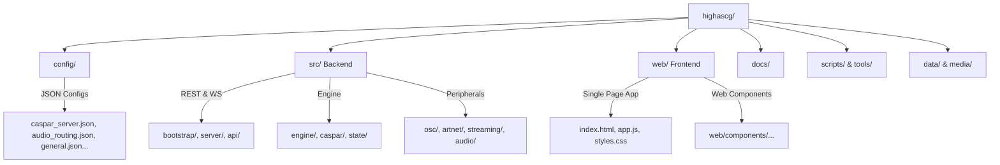

# 🪐 HighAsCG: Virtual Project Walkthrough & System Guide

Welcome to the **HighAsCG** project virtual walkthrough! This document serves as a comprehensive, visual, and technical map of the project. It details how the code is organized, what individual files do, how the setup/startup sequence works, and why operators and users can **safely and reliably run this system** in high-pressure live production settings.

---

## 🛡️ Running HighAsCG Safely: Core Safety Design

Live broadcast and show-control servers must be extremely stable. HighAsCG is built around a "fail-safe" and "sandboxed" architecture to guarantee that manual operations, crashes, or double-clicks do not lock up high-end hardware, display ports, or standard system services.

### 1. Single-Instance Safety (Process Locking)
To prevent multiple instances from running at the same time and causing port conflicts (e.g., AMCP port `5250` or HTTP port `8080`) or locking expensive PCI video cards (like Blackmagic Decklink), the Openbox autostart script employs a strict single-instance file lock:
```bash
exec 9>/tmp/caspar-openbox-autostart.lock
if ! flock -n 9; then
  exit 0
fi
```
> [!IMPORTANT]
> Because of **`flock -n`**, if a background loop is already running, subsequent attempts to start the autostart script (manually or via desktop session restarts) will instantly and safely exit without spawning duplicate, conflicting processes.

### 2. Isolated Environment & Custom Libraries
To prevent interfering with the global operating system, HighAsCG relies on isolated local libraries rather than system-wide defaults. The [/home/casparcg/highascg/run.sh](file:///home/casparcg/highascg/run.sh) script handles this seamlessly:
* It sets `LD_LIBRARY_PATH` to `/home/casparcg/highascg/lib`, pointing the server to customized library builds (e.g., specific CEF, ffmpeg, or Decklink drivers).
* It unsets `LD_PRELOAD` to prevent standard desktop tools or loaders from injecting conflicting library calls into the media rendering engine.

### 3. Graceful Automated Recovery (Self-Healing)
Live environments cannot afford downtime. In [/home/casparcg/.config/openbox/autostart](file:///home/casparcg/.config/openbox/autostart), the runner script is started with `CASPAR_RESPAWN=1`. 
* If a Chromium Embedded Framework (CEF) page or HTML overlay causes CasparCG to segfault or crash, the script intercepts the exit status.
* Rather than staying down, it logs the exit code and automatically respawns the renderer in a clean state after a safe cooldown period (5 seconds).

### 4. Deterministic CEF Cache Housekeeping
Chromium Embedded Framework (CEF) stores profiles and temporary caches that can easily become corrupted if the system experiences a sudden power loss or unclean shutdown. HighAsCG prevents cache corruption issues by cleanly wiping temporary data on startup:
```bash
rm -rf /home/casparcg/highascg/cef-cache/* 2>/dev/null
```
This guarantees that HTML overlays always load from a pristine, fresh state every time the application starts.

### 5. Non-Destructive User-Level Running
HighAsCG runs entirely within user space under `/home/casparcg`. It does not perform destructive actions on your operating system. System-level settings—such as updating GPU resolutions via `xrandr` or mounting backup drives—are strictly gated behind safe, passwordless `sudo` rules for specific files (see [docs/HIGHASCG_PASSWORDLESS_SUDO.md](file:///home/casparcg/highascg/docs/HIGHASCG_PASSWORDLESS_SUDO.md)), so the application cannot run arbitrary root commands.

---

## 🚀 Setup & Startup: The Ignition Sequence

For HighAsCG to orchestrate displays, media playout, and live graphics, a specific startup sequence takes place. Here is a breakdown of what runs and why:

### 1. The Openbox Desktop Autostart
File: [/home/casparcg/.config/openbox/autostart](file:///home/casparcg/.config/openbox/autostart)

When the Linux graphical environment (usually managed by `nodm` and `Openbox` window manager) starts, it executes this script. Let's look at the key steps:

* **Disabling Screen Blanking & Power Saving**:
  ```bash
  xset s off       # Turn off screen saver
  xset s noblank   # Do not blank the video signal
  xset -dpms       # Disable DPMS (energy saving)
  ```
  *Why:* This keeps display outputs (LED walls, projectors, monitors) active indefinitely, ensuring the screen doesn't go black mid-show.
* **Hiding the Mouse Cursor**:
  ```bash
  unclutter -idle 1 -root &
  ```
  *Why:* Using `unclutter` hides the mouse cursor automatically after 1 second of inactivity, ensuring mouse pointers never show up on top of live broadcasts or LED panels.
* **Running the Media Scanner**:
  ```bash
  /usr/bin/casparcg-scanner &
  ```
  *Why:* The scanner is a background companion process that indexes and generates thumbnails for all video, audio, and template files inside the media directory, updating the backend database in real-time.
* **Launching the Playout Runner**:
  ```bash
  export CASPAR_RESPAWN=1
  export CASPAR_RESTART_SLEEP=5
  bash /home/casparcg/highascg/run.sh >> /tmp/caspar.log 2>&1
  ```
  *Why:* Kicks off the CasparCG wrapper loop in self-healing mode, redirecting logs to a temporary file for diagnostic inspection.

---

### 2. The CasparCG Runner
File: [/home/casparcg/highascg/run.sh](file:///home/casparcg/highascg/run.sh)

This shell script acts as a highly resilient daemon for the CasparCG server process:

* **Environment Setup**:
  * Resolves paths to the workspace root, binary (`bin/casparcg`), configurations (`config/casparcg.config`), and custom dynamic libraries (`lib/`).
* **Exit Code Trapping**:
  * Normally, a planned AMCP `RESTART` exits with code `5`. However, some Linux/CEF builds segfault during teardown, exiting with code `139`.
  * `run.sh` recognizes both `5` and `139` as valid restart codes, triggering an automatic relaunch after a short grace period.
* **Loop Options**:
  * If `CASPAR_RESPAWN=1` is set, it ignores the specific exit code and guarantees the process is spun back up no matter what caused it to close (e.g. system signals, unexpected crashes, etc.).

---

### 3. Production Staged Startup (Optional)
File: [tools/casparcg-staged-start.sh](file:///home/casparcg/highascg/tools/casparcg-staged-start.sh)

In live environments, you might want the Node.js API and frontend to start *before* the rendering engine does, allowing you to tweak configuration parameters or upload new assets before "arming" the renderer:
* HighAsCG starts first and remains in standby.
* Once the operator confirms configurations are valid, they click "Arm" in the UI.
* This touches `/home/casparcg/highascg/data/caspar-armed` (the trigger file), signaling the supervisor wrapper to start the render engine.

---

## 📂 The HighAsCG Folder Structure Map

Here is a walk through the directory structure of the project, explaining what resides in each folder and how they power the system:



### 1. Root Folder Files
* [/home/casparcg/highascg/index.js](file:///home/casparcg/highascg/index.js) — The master entry point of the Node.js application. It boots the `ConnectionManager`, initiates the HTTP and WebSocket servers, and binds standard event handlers.
* [/home/casparcg/highascg/package.json](file:///home/casparcg/highascg/package.json) — Defines third-party dependencies (like `ws` for WebSockets, `osc` for UDP communication, and optional additions like `three` for 3D visualizers).
* [/home/casparcg/highascg/.highascg-state.json](file:///home/casparcg/highascg/.highascg-state.json) & `autosave.json` — The JSON database files containing persistent state, active scene files, timeline schedules, and screen slice mappings.

---

### 2. The Configuration Folder (`config/`)
All subsystem parameters are declared in [/home/casparcg/highascg/config/](file:///home/casparcg/highascg/config/):
* `caspar_server.json` — Defines CasparCG video channels, resolution profiles, and screen outputs.
* `general.json` — Core port bindings, hostnames, and service settings.
* `audio_routing.json` & `audio_outputs.json` — Maps logical audio feeds to physical PipeWire, ALSA, or Decklink outputs.
* `device_graph.json` — Describes physical patch bays, cabling connections, and GPU hardware ports.
* `screen_destinations.json` — Defines parameters for targeted display layers (LED screens, multi-view setups).

---

### 3. The Backend Source (`src/`)
Divided into clean, modular domains inside [/home/casparcg/highascg/src/](file:///home/casparcg/highascg/src/):
* **Core & Network**:
  * `bootstrap/` — Handles initial hardware checks, directory mapping, and state validation.
  * `server/` — Establishes the Express/HTTP router and the high-speed WebSocket broadcasting layer.
  * `api/` — A RESTful router providing structured endpoints (`/api/settings`, `/api/scenes`, `/api/streams`, `/api/audio`).
* **CasparCG Connection**:
  * `caspar/` — Manages raw TCP sockets and AMCP protocol translation, ensuring commands sent to the rendering engine are framed correctly.
* **Playout Control**:
  * `engine/` — Manages global scene stacks, transitions, multi-channel layers, and timelines.
  * `state/` — The reactive state store. When configurations change, it automatically commits them to the state JSON.
* **Integrations & Hardware**:
  * `osc/` — An OSC (Open Sound Control) UDP client and listener, streaming real-time playback statuses from the renderer back to the UI.
  * `audio/` — Interacts with the host sound driver (e.g., PipeWire/ALSA) to manage system-wide volume and card setups.
  * `streaming/` — Orchestrates WebRTC/RTMP streaming pipelines, allowing low-latency browser monitoring.
  * `artnet/` — Directs DMX/ArtNet fixtures and architectural pixel fixtures for integrated lighting cue control.
* **Extensibility**:
  * [/home/casparcg/highascg/src/module-registry.js](file:///home/casparcg/highascg/src/module-registry.js) — The optional-module gateway. It enables loose coupling for advanced directories (such as `previs` for 3D simulation or `tracking` for sensors). If those optional packages are deleted, the application swallows the error and boots normally.

---

### 4. The Frontend Source (`web/`)
HighAsCG features a premium, responsive Single Page Application (SPA) located in [/home/casparcg/highascg/web/](file:///home/casparcg/highascg/web/):
* `index.html` — The main structural wrapper.
* `app.js` — The core logic, initializing WebSocket event listeners and state synchronization.
* `styles.css` — High-fidelity modern styling, utilizing dark modes, visual highlights, and fluid transitions.
* `components/` — A modular directory containing over 120 custom Web Components! Notable components include:
  * `device-view.js` — The graphical patch bay. It renders hardware GPUs, input adapters, and physical display models.
  * `preview-canvas-panel.js` — A canvas rendering feed providing a visual preview of what is actively playing.
  * `audio-mixer-panel.js` — An audio slider console mimicking standard hardware desks.
  * `previs-pgm-3d.js` — A WebGL Three.js component that renders a virtual 3D stage/studio, allowing operators to pre-visualize screens in virtual space.
  * `timeline-editor.js` — An interactive timeline editor with drag-and-drop support for cues, clips, and commands.

---

### 5. Auxiliary Directories
* `docs/` — Rich design papers, operational manuals, and hardware configurations (including this virtual walkthrough!).
* `tools/` — Maintenance utilities, smoke tests, config converters, and AMCP diagnostic scripts.
* `scripts/` — Automated installation phases, environment modifiers, and backup/restore recipes.

---

## 🛠️ Operational Cheat Sheet: How to Manage the Services

### Start/Stop Commands
If you need to manage HighAsCG manually, use the standard Node/NPM scripts:

```bash
# To run in standard production mode:
npm start

# To run in developer mode with hot-reloads:
npm run dev

# To check if all APIs and systems are healthy (smoke tests):
npm run smoke -- 8080
```

### Checking Active Outputs
You can inspect which ports are actively bound and running using common command line tools:

```bash
# Check if HighAsCG is listening on port 8080
ss -tlnp | grep 8080

# Check if CasparCG is listening on AMCP port 5250
ss -tlnp | grep 5250
```

### Reading Logs
If something is not working as expected, logs are organized by domain:
* HighAsCG Server: Located in `/home/casparcg/highascg/server.log`
* CasparCG Engine: Located in `/tmp/caspar.log` (or within the configured path in `run.sh`)

---

> [!TIP]
> **Summary Recommendation for Operators:** You can run HighAsCG with complete confidence. Thanks to robust file locks, self-healing process loops, environment isolation, and isolated library loading, the system is designed to handle glitches gracefully without affecting the underlying operating system.
