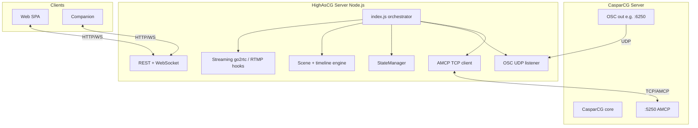

# HighAsCG — Project Breakdown

> Standalone CasparCG graphics controller with timeline editor, scene management, live preview, DMX pixel mapping, DeckLink input routing, RTMP (FFmpeg) publishing hooks, and multi-protocol integration.

> **Work-order status (checkboxes, notes):** [project_status.md](./project_status.md). **Numbered WOs** live alongside this file under `work/*.md`.

**Recent planning docs:** [Look & layer presets (Barco-style programming)](./WO_look-and-layer-presets.md) · [PixelHue companion + tandem looks / RTSP](./WO_pixelhue-companion-and-tandem-looks.md) · [Device view — program index (WO-33)](./33_WO_DEVICE_VIEW_INDEX.md) — children: [33a](./33a_WO_DEVICE_VIEW_DATA_MODEL_AND_API.md) [33b](./33b_WO_DEVICE_VIEW_HOST_ENUMERATION.md) [33c](./33c_WO_DEVICE_VIEW_CASPAR_BACKPLANE_UI.md) [33d](./33d_WO_DEVICE_VIEW_PIXELHUE_CABLING.md) [33e](./33e_WO_DEVICE_VIEW_EDID_MATCH_AND_APPLY.md) [33f](./33f_WO_DEVICE_VIEW_SETTINGS_MIGRATION.md) [33g](./33g_WO_DEVICE_VIEW_QA_DOCS_ACCESSIBILITY.md)

---

## Architecture (diagram)



---

## Architecture Overview

```
┌──────────────────────────────────────────────────────────────────┐
│                      Browser SPA (web/)                          │
│  Components: Inspector, Timeline, Scenes, Multiview, Dashboard   │
│  Lib: StateStore, WebRTC, WS client, Scene/Timeline state        │
├──────────────────────────────────────────────────────────────────┤
│                         WebSocket + HTTP API                     │
├──────────────────────────────────────────────────────────────────┤
│                      Node.js Server (src/)                       │
│  ┌──────────┐ ┌────────┐ ┌──────────┐ ┌─────────┐ ┌──────────┐ │
│  │ AMCP TCP │ │ Engine │ │ Streaming│ │   OSC   │ │   DMX    │ │
│  │ client   │ │ scene/ │ │ go2rtc/  │ │ listener│ │ sampling │ │
│  │ protocol │ │ tline/ │ │ UDP/NDI  │ │ state   │ │ Art-Net/ │ │
│  │ batch    │ │ PIP/FTB│ │ RTMP cfg │ │ vars    │ │ sACN     │ │
│  └────┬─────┘ └───┬────┘ └────┬─────┘ └────┬────┘ └────┬─────┘ │
│       │           │           │             │           │       │
├───────┴───────────┴───────────┴─────────────┴───────────┴───────┤
│       TCP            AMCP              UDP/NDI           UDP    │
│        ▼              ▼                  ▼                ▼     │
│   CasparCG         CasparCG           go2rtc         Art-Net/  │
│   Server           AMCP 5250          WebRTC         sACN DMX  │
└──────────────────────────────────────────────────────────────────┘
```

### Key workflows

**A — Trigger playout:** UI (`sources-panel` / dashboard) → `POST /api/mixer/*` or scene routes → `routes-mixer.js` / `routes-scene.js` → `AmcpClient` → AMCP `LOADBG` / `PLAY` on Caspar.

**B — Real-time status:** Caspar OSC → `osc-listener.js` → `osc-state.js` / `StateManager` → `ws-server.js` broadcasts → Web UI (`vu-meter`, timers, variables).

**C — Offline prep & sync:** Edit with Caspar disconnected → state in `.highascg-state.json` / local persistence → **Publish** / project sync via `routes-project.js` and related ingest paths to align media and bundles with production.

---

## Feature Catalog

### 1. CasparCG AMCP Protocol Client

Full AMCP 2.x protocol implementation with ~79 commands across 7 categories.

| Module | Lines | Connections | Description |
|--------|-------|-------------|-------------|
| `src/caspar/amcp-client.js` | 369 | events, amcp-basic, amcp-mixer, amcp-... | Facade composing all sub-modules, `_send()` with serialized queue + per-command timeout |
| `src/caspar/amcp-protocol.js` | 276 | amcp-utils, tcp-client, amcp-protocol | AMCP response state machine (NEXT/SINGLE_LINE/MULTI_LINE), callback dispatch |
| `src/caspar/connection-manager.js` | 249 | events, tcp-client, amcp-protocol, am... | TCP lifecycle, auto-reconnect, health checks, disconnect cleanup |
| `src/caspar/tcp-client.js` | 160 | net, events | Raw TCP with CRLF line splitting, exponential backoff reconnect |
| `src/caspar/amcp-basic.js` | 165 | amcp-utils, amcp-client, amcp-types | PLAY, LOADBG, LOAD, PAUSE, RESUME, STOP, CLEAR, CALL, SWAP, ADD, REMOVE, PRINT, LOG, SET, LOCK, PING |
| `src/caspar/amcp-mixer.js` | 215 | amcp-utils, amcp-client, amcp-types | All MIXER commands with DEFER + query mode |
| `src/caspar/amcp-cg.js` | 66 | amcp-utils, amcp-client | CG ADD/PLAY/STOP/NEXT/REMOVE/CLEAR/UPDATE/INVOKE/INFO |
| `src/caspar/amcp-data.js` | 49 | amcp-utils, amcp-client | DATA STORE/RETRIEVE/LIST/REMOVE |
| `src/caspar/amcp-query.js` | 129 | amcp-utils, amcp-client | INFO, VERSION, CLS, TLS, FLS, CINF, DIAG, GL, HELP, RESTART, KILL |
| `src/caspar/amcp-thumbnail.js` | 37 | amcp-utils, amcp-client | THUMBNAIL LIST/RETRIEVE/GENERATE/GENERATE_ALL |
| `src/caspar/amcp-batch.js` | 334 | amcp-client | BEGIN…COMMIT batching with timeout + sequential fallback |
| `src/caspar/amcp-constants.js` | 163 | - | Transitions, tweens, blend modes, video modes, return codes |
| `src/caspar/amcp-parsers.js` | 134 | xml2js | Response parsers (CLS/TLS/INFO → structured objects) |
| `src/caspar/amcp-types.js` | 43 | - | JSDoc type definitions |
| `src/caspar/amcp-simulated.js` | 34 | events | Offline/simulated responses for `--no-caspar` mode |

### 2. Scene Management & Live Production

| Module | Lines | Connections | Description |
|--------|-------|-------------|-------------|
| `src/engine/scene-take.js` | 271 | playback-tracker, scene-native-fill, ... | Scene take execution — transitions a look (set of layers) onto program |
| `src/engine/scene-take-lbg.js` | 436 | playback-tracker, amcp-utils, scene-n... | LOADBG-style stacking variant of scene take |
| `src/engine/scene-transition.js` | 280 | routing, program-layer-bank, scene-ex... | Transition logic (MIX, CUT, PUSH, WIPE, STING) |
| `src/engine/scene-exit-layers.js` | 199 | amcp-batch, amcp-utils, routing, live... | Clearing exiting layers after transition |
| `src/engine/scene-native-fill.js` | 367 | cinf-parse, routing, config-modes, ch... | Native fill/layout helpers for scene geometry |
| `src/engine/ftb-pgm-prv.js` | 144 | amcp-utils, routing, playback-tracker... | Fade-to-black across PGM+PRV channels |
| `src/engine/clip-end-fade.js` | 240 | playback-tracker, pip-overlay | Auto-fade at clip end point |
| `src/engine/program-layer-bank.js` | 15 | - | A/B program stack management |
| `src/state/live-scene-state.js` | 116 | persistence, routing | Persisted per-channel "what scene is live" |
| `src/state/live-scene-reconcile.js` | 187 | util, xml2js, routing, live-scene-sta... | Scene reconciliation after reconnect |

### 3. Timeline Editor & Playback

| Module | Lines | Connections | Description |
|--------|-------|-------------|-------------|
| `src/engine/timeline-engine.js` | 137 | events, timeline-playback, program-re... | Timeline data model — layers, clips, keyframes, CRUD |
| `src/engine/timeline-playback.js` | 370 | program-resolution, timeline-playback... | Playback transport — play/pause/stop/seek, loop, ticker |
| `src/engine/timeline-playback-amcp.js` | 267 | routing, amcp-utils, playback-tracker... | AMCP scheduling — PLAY/LOAD/MIXER per tick |
| `src/engine/timeline-playback-helpers.js` | 102 | audio-route, amcp-utils | Effect→AMCP builders, audio filter suffix, constants |
| `src/engine/audio-route.js` | 40 | - | Logical audio routes → Caspar audioFilter strings |

### 4. PIP Overlay System

| Module | Lines | Connections | Description |
|--------|-------|-------------|-------------|
| `src/engine/pip-overlay.js` | 475 | scene-native-fill, amcp-batch | AMCP line builders for HTML PIP templates (server) |
| `web/lib/pip-overlay-amcp.js` | 243 | pip-overlay-registry.js | Shared AMCP line builders (browser + tooling) |
| `src/api/routes-pip-overlay.js` | 132 | response, pip-overlay | REST: apply/update/remove PIP overlays |
| `templates/pip-*.html` | ? | - | HTML/CSS PIP overlay templates (border, shadow, glow, edge strip) |

### 5. Multiview

| Module | Lines | Connections | Description |
|--------|-------|-------------|-------------|
| `src/api/routes-multiview.js` | 386 | fs, path, response, routing, persiste... | Multiview grid layout, route sources, HTML overlay, DeckLink cells |
| `web/components/multiview-editor.js` | **502** ⚠️ | multiview-state.js, live-view.js, str... | Drag-and-drop multiview layout editor |
| `templates/multiview-overlay.html` | ? | - | Multiview HTML overlay template |

### 6. Streaming & Live Preview (WebRTC)

| Module | Lines | Connections | Description |
|--------|-------|-------------|-------------|
| `src/streaming/go2rtc-manager.js` | **530** ⚠️ | fs, http, path, child_process, ndi-re... | go2rtc process lifecycle, YAML generation, UDP bridges |
| `src/streaming/go2rtc-config.js` | 92 | child_process | Capture tier detection (local/NDI/UDP), config builders |
| `src/streaming/caspar-ffmpeg-setup.js` | 271 | go2rtc-manager, ndi-resolve, amcp-client | Caspar ADD/REMOVE STREAM consumers |
| `src/streaming/stream-config.js` | 104 | - | Streaming config resolution (quality, hardware accel) |
| `src/streaming/streaming-udp-ports.js` | 114 | dgram | Free base port scan with auto-relocation |
| `src/streaming/ndi-resolve.js` | 222 | child_process | NDI source naming and validation |
| `src/bootstrap/streaming-lifecycle.js` | 259 | - | Start/stop/restart streaming subsystem |
| `src/api/routes-streaming.js` | 217 | http, response, go2rtc-manager, ndi-r... | Toggle/restart streaming, WebRTC proxy, NDI sources |

### 7. OSC Integration

| Module | Lines | Connections | Description |
|--------|-------|-------------|-------------|
| `src/osc/osc-listener.js` | 98 | osc, osc-state | UDP OSC receiver with stats |
| `src/osc/osc-state.js` | 426 | events | Aggregates Caspar OSC → channels (layers, audio meters, profiler) |
| `src/osc/osc-variables.js` | 115 | - | OSC snapshot → Companion-style variables |
| `src/osc/osc-config.js` | 38 | - | Normalize OSC listen address/port |
| `src/bootstrap/osc-lifecycle.js` | 79 | - | Start/stop/restart OSC subsystem |

### 8. DMX Pixel Mapping

| Module | Lines | Connections | Description |
|--------|-------|-------------|-------------|
| `src/sampling/dmx-sampling.js` | 374 | fs, path, worker_threads, dmx-output,... | Frame sampling from Caspar → pixel→fixture mapping via worker |
| `src/sampling/dmx-sampling-ingress.js` | 258 | fs, child_process, amcp-utils, go2rtc... | UDP/FILE ingress, ffmpeg readers, FIFO, Caspar consumers |
| `src/sampling/sampling-worker.js` | 139 | worker_threads | Worker thread: per-pixel RGB extraction, gamma, LED formats |
| `src/sampling/dmx-output.js` | 106 | dmxnet, sacn | Art-Net + sACN output senders |

### 9. CasparCG Config Generator & Routing

| Module | Lines | Connections | Description |
|--------|-------|-------------|-------------|
| `src/config/config-generator.js` | 119 | config-modes, config-generator-builde... | Main `buildConfigXml()` — screens, multiview, DeckLink, streaming |
| `src/config/config-generator-builders.js` | 49 | config-generator-utils, config-genera... | Facade for config XML builders |
| `src/config/config-generator-utils.js` | 67 | - | XML escaping, bit padding, profile checks |
| `src/config/config-generator-audio-routing.js` | 129 | routing, defaults | Audio routing logic and configuration merging |
| `src/config/config-generator-audio-xml.js` | 429 | streaming, config-modes | XML fragment builders for audio layouts and consumers |
| `src/config/config-generator-screen-xml.js` | 145 | - | XML fragment builders for screen geometry and extras |
| `src/config/config-generator-osc-xml.js` | 41 | - | XML fragment builder for OSC configuration |
| `src/config/config-modes.js` | 168 | - | Video mode presets and dimensions |
| `src/config/config-manager.js` | 112 | fs, path, events, default | Load/save `highascg.config.json` |
| `src/config/config-compare.js` | 245 | xml2js, routing, config-generator, co... | Compare generated vs running server config (incl. DeckLink consumers) |
| `src/config/routing.js` | **677** ⚠️ | path, pip-overlay, fs, routes-multiview | Channel map (PGM/PRV/MVR/inputs), DeckLink `PLAY` setup, `route://` helpers |
| `src/config/channel-map-from-ctx.js` | 73 | routing, server-info-config | `channelMap` snapshot for API/state (resolutions, inputs) |
| `src/config/decklink-config-validate.js` | 44 | routing | Warnings for DeckLink input vs output index conflicts (save/settings) |
| `src/config/rtmp-output.js` | 153 | default, routing, config-generator-bu... | RTMP FFmpeg consumer XML; server URL + stream key → effective URL |
| `src/config/multiview-helpers.js` | 25 | - | Multiview XML / screen-consumer helpers |

### 10. Media Management

| Module | Lines | Connections | Description |
|--------|-------|-------------|-------------|
| `src/media/local-media.js` | 429 | path, fs, os, response, local-media-f... | Safe path resolution, HTTP file serving, DELETE, recursive scan |
| `src/media/local-media-ffmpeg.js` | 337 | path, fs, crypto, child_process, loca... | ffprobe, waveform bars, thumbnail PNG, disk cache |
| `src/media/cinf-parse.js` | 37 | - | Parse CINF lines for duration/resolution |
| `src/api/routes-media.js` | 207 | response, cinf-parse, local-media, pe... | Thumbnails, local media, cinf, media refresh |
| `src/api/routes-ingest.js` | 416 | fs, path, child_process, busboy, unzi... | Upload, URL download, WeTransfer ingest |

### 11. PGM Recording

| Module | Lines | Connections | Description |
|--------|-------|-------------|-------------|
| `src/api/routes-pgm-record.js` | 247 | path, response, routing, amcp-utils | FFmpeg FILE consumer on PGM channel, env-tunable encoding |

### 12. State Management

| Module | Lines | Connections | Description |
|--------|-------|-------------|-------------|
| `src/state/state-manager.js` | 392 | events, xml2js, cinf-parse, media-bro... | Channels, media, templates, variables, OSC mirror, change log |
| `src/state/playback-tracker.js` | 499 | cinf-parse, media-browser-dedupe, loc... | Playback matrix (what's playing where) |
| `src/api/get-state.js` | 101 | live-scene-state, playback-tracker, c... | Full HTTP/WebSocket snapshot (incl. `decklinkInputsStatus`, `channelMap`) |
| `src/utils/persistence.js` | 61 | fs, path | Key-value persistence (live scenes, project on disk, IP splash boot id) |

### 13. HTTP Server & WebSocket

| Module | Lines | Connections | Description |
|--------|-------|-------------|-------------|
| `src/server/http-server.js` | 289 | http, fs, path, os, cors | Static files, `/api/*` routing, CORS, Companion instance prefix |
| `src/server/ws-server.js` | 235 | ws, ws-amcp-dispatch, persistence, st... | WebSocket on same port, state broadcast, variable updates, first-client hooks |
| `src/server/cors.js` | 20 | - | CORS header merge |

### 14. Bootstrap & Operability

| Module | Lines | Connections | Description |
|--------|-------|-------------|-------------|
| `src/bootstrap/startup-host-ip-splash.js` | ? | - | After AMCP connect: LAN IPv4 on HTML CG layer (screen + DeckLink channels); cleared when first WS UI client connects |
| `src/bootstrap/fetch-server-info-config.js` | 72 | config-compare, query-cycle, startup-... | INFO CONFIG fetch for channel map / comparisons |

### 15. REST API (`src/api/router.js` + route modules)

Roughly **26** `routes-*.js` modules plus `router.js`, `get-state.js`, `response` helpers. Caspar-gated vs always-available paths follow `router.js` comments (WO-03 offline behavior).

| Route module | Coverage |
|-------------|----------|
| `routes-amcp.js` | Basic AMCP commands via REST |
| `routes-mixer.js` | MIXER commands + query mode |
| `routes-cg.js` | CG template commands |
| `routes-data.js` | DATA store/retrieve |
| `routes-state.js` | State snapshot, variables, channels, server info |
| `routes-scene.js` | Scene take |
| `routes-timeline.js` | Timeline CRUD, playback control |
| `routes-ftb.js` | Fade-to-black |
| `routes-settings.js` | Get/set settings, hardware displays, `decklinkInputsStatus`, validation warnings |
| `routes-audio.js` | Audio devices, routing, ALSA config |
| `routes-caspar-config.js` | Generate/apply CasparCG config XML |
| `routes-host-stats.js` | CPU/RAM/disk stats |
| `routes-logs.js` | Log ring buffer |
| `routes-project.js` | Production bundle sync/diff/apply |
| `routes-system-setup.js` | LAN IPs, Tailscale, Syncthing hints |
| `routes-streaming.js` | Streaming toggle / WebRTC / NDI |
| `routes-multiview.js` | Multiview apply / layout |
| `routes-pip-overlay.js` | PIP overlays |
| `routes-led-test-card.js` | LED wall test card |
| `routes-pgm-record.js` | PGM recording |
| `routes-ingest.js` | Ingest |
| `routes-osc.js`, `routes-config.js`, `routes-misc.js`, `routes-system-staged.js` | OSC, config, misc, staged system |

### 19. 3D Previs & Tracking Module

| Module | Lines | Connections | Description |
|--------|-------|-------------|-------------|
| `src/previs/register.js` | 71 | routes-models | |
| `src/previs/routes-models.js` | 270 | fs, path, crypto, busboy, persistence... | |
| `src/previs/types.js` | 108 | - | |
| `web/assets/modules/previs/entry.js` | 141 | /components/previs-pgm-3d.js, /lib/pr... | |
| `web/components/previs-mesh-inspector.js` | **617** ⚠️ | previs-state.js, previs-uv-mapper.js,... | |
| `web/components/previs-pgm-3d-dropzone.js` | 175 | previs-model-loader.js, previs-state.js | |
| `web/components/previs-pgm-3d-inspector-binder.js` | 353 | previs-mesh-inspector.js, previs-sett... | |
| `web/components/previs-pgm-3d-keyboard.js` | 143 | previs-scene.js, previs-scene-model.j... | |
| `web/components/previs-pgm-3d-toolbar.js` | 151 | - | |
| `web/components/previs-pgm-3d.js` | 459 | previs-scene.js, previs-video-texture... | |
| `web/components/previs-settings-modal-pane.js` | 38 | previs-state.js, previs-settings-pane... | |
| `web/components/previs-settings-panel.js` | 237 | previs-state.js | |
| `web/components/previs-uv-editor.js` | 212 | - | |
| `web/lib/previs-mesh-info.js` | 301 | three | |
| `web/lib/previs-model-loader.js` | 275 | previs-mesh-info.js, three | |
| `web/lib/previs-scene-model.js` | **623** ⚠️ | previs-mesh-info.js, previs-model-loa... | |
| `web/lib/previs-scene.js` | 367 | three | |
| `web/lib/previs-state.js` | 435 | - | |
| `web/lib/previs-stream-sources.js` | 147 | previs-video-texture.js, three | |
| `web/lib/previs-texture-crop.js` | 84 | - | |
| `web/lib/previs-uv-mapper.js` | 383 | web/lib/previs-uv-mapper.js | |
| `web/lib/previs-video-texture.js` | 345 | three | |
| `web/styles/previs.css` | **551** ⚠️ | - | |

### 16. Project Sync & Bundles

| Module | Lines | Connections | Description |
|--------|-------|-------------|-------------|
| `src/api/routes-project.js` | 286 | response, live-scene-state, scene-tra... | Production bundle export/import, manifest diff, media sync |

### 17. Companion Integration

- Instance URL prefix (`/instance/:id/...`) for static + API
- Selection endpoint for button state
- Variable mirror to `StateManager`

### 18. Utilities

| Module | Lines | Connections | Description |
|--------|-------|-------------|-------------|
| `src/utils/logger.js` | 59 | - | Logging with min-level filter |
| `src/utils/log-buffer.js` | 64 | - | Ring buffer for `/api/logs` UI |
| `src/utils/periodic-sync.js` | 325 | routing, live-scene-reconcile, playba... | CLS/TLS refresh, OSC playback supplement |
| `src/utils/hardware-info.js` | 236 | child_process, fs, path | Host/OS facts for settings |
| `src/utils/program-resolution.js` | 26 | routing, server-info-config | Program canvas size per screen |
| `src/utils/query-cycle.js` | 361 | xml2js, handlers, tcp-client | AMCP query helpers |

---

## Web UI Components

### Shell & Workspace

| Module | Lines | Connections | Description |
|--------|-------|-------------|-------------|
| `header-bar.js` | 450 | project-state.js, scene-state.js, das... | |
| `dashboard.js` | 486 | dashboard-state.js, timeline-state.js... | |
| `dashboard-cell.js` | 115 | dashboard-state.js, api-client.js | |
| `connection-eye.js` | 338 | api-client.js | |
| `output-status.js` | 74 | ui-font.js, osc-client.js | |
| `profiler-display.js` | 73 | ui-font.js, osc-client.js | |
| `now-playing.js` | 110 | playback-timer.js, api-client.js, ui-... | |
| `playback-timer.js` | 357 | ui-font.js, osc-client.js | |
| `vu-meter.js` | 63 | - | |
| `variables-panel.js` | 142 | variable-state.js, app.js, api-client.js | |
| `live-view.js` | 73 | webrtc-client.js, stream-state.js | |
| `sync-modal.js` | 125 | api-client.js | |
| `publish-modal.js` | 257 | api-client.js, form-upload.js | |
| `logs-modal.js` | 268 | api-client.js, app.js | |
| `settings-modal.js` | **872** ⚠️ | api-client.js, settings-state.js, sys... | |
| `settings-modal-caspar-ui.js` | **939** ⚠️ | api-client.js, settings-state.js, sys... | |
| `settings-modal-rtmp.js` | 153 | - | |
| `system-settings.js` | 476 | api-client.js, variable-state.js, app.js | |
| `led-test-modal.js` | 219 | state-store.js | |
| `live-input-modal.js` | 233 | api-client.js, state-store.js | |

### Scenes

| Module | Lines | Connections | Description |
|--------|-------|-------------|-------------|
| `scenes-editor.js` | **649** ⚠️ | scene-state.js, api-client.js, previe... | |
| `scenes-shared.js` | 198 | dashboard-state.js, math-input.js, sc... | |
| `scenes-compose.js` | 412 | fill-math.js, mixer-fill.js, api-clie... | |
| `scenes-preview-runtime.js` | 367 | api-client.js, audio-routes.js, mixer... | |
| `scene-list.js` | 346 | scenes-shared.js, scenes-editor-suppo... | |
| `scene-layer-row.js` | 297 | scene-state.js | |
| `preview-canvas.js` | 17 | preview-canvas-draw.js, preview-canva... | |
| `preview-canvas-panel.js` | **608** ⚠️ | live-view.js, stream-state.js, settin... | |
| `preview-canvas-draw.js` | 16 | preview-canvas-draw-base.js, preview-... | |
| `preview-canvas-draw-stacks.js` | 459 | ui-font.js, fill-math.js, timeline-cl... | |

### Inspector

| Module | Lines | Connections | Description |
|--------|-------|-------------|-------------|
| `inspector-panel.js` | 461 | dashboard-state.js, scene-state.js, a... | |
| `inspector-panel-views.js` | 388 | dashboard-state.js, scene-state.js, f... | |
| `inspector-panel-timeline.js` | 488 | timeline-state.js, api-client.js, mat... | |
| `inspector-common.js` | 122 | math-input.js | |
| `inspector-mixer.js` | 464 | api-client.js, app.js, variable-state... | |
| `inspector-effects.js` | 197 | inspector-common.js, effect-registry.js | |
| `inspector-fill.js` | 296 | fill-math.js, mixer-fill.js, api-clie... | |
| `inspector-fill-timeline.js` | 240 | math-input.js, timeline-state.js, ins... | |
| `inspector-transition.js` | 87 | math-input.js, dashboard-state.js | |
| `inspector-pip-overlay.js` | 436 | inspector-common.js, api-client.js, p... | |
| `device-view-inspectors.js` | 54 | device-view-inspector-gpu, ... | Facade for device view specialized inspectors |
| `device-view-inspector-gpu.js` | 256 | device-view-actions.js | GPU resolution, EDID, and OS settings inspector |
| `device-view-inspector-audio.js` | 97 | device-view-actions.js | PortAudio and routing settings for audio outputs |
| `device-view-inspector-stream.js` | 172 | device-view-actions.js | RTMP/NDI/SRT streaming output controls |
| `device-view-inspector-record.js` | 102 | device-view-actions.js | PGM/PRV recording output controls |
| `device-view-inspector-caspar.js` | 90 | device-view-actions.js | Global Caspar host and build profile settings |
| `device-view-inspector-decklink.js` | 15 | device-view-actions.js | DeckLink IO direction toggle |

### Timeline

| Module | Lines | Connections | Description |
|--------|-------|-------------|-------------|
| `timeline-editor.js` | 373 | timeline-state.js, scene-state.js, ap... | |
| `timeline-editor-handlers.js` | 495 | timeline-state.js, timeline-clip-layo... | |
| `timeline-canvas.js` | 478 | timeline-track-heights.js, timeline-c... | |
| `timeline-canvas-clip.js` | 390 | ui-font.js, waveform-fetch-queue.js, ... | |
| `timeline-canvas-utils.js` | 83 | - | |
| `timeline-canvas-render.js` | 356 | ui-font.js, timeline-track-heights.js... | |
| `timeline-transport.js` | 302 | timeline-state.js, dashboard-state.js... | |

### Multiview & Pixel Map

| Module | Lines | Connections | Description |
|--------|-------|-------------|-------------|
| `multiview-editor.js` | **502** ⚠️ | multiview-state.js, live-view.js, str... | |
| `multiview-editor-canvas.js` | 256 | ui-font.js, multiview-state.js, api-c... | |
| `pixel-map-editor.js` | 341 | ui-font.js, dmx-state.js, api-client.... | |
| `fixture-inspector.js` | 111 | dmx-state.js | |

### Audio

| Module | Lines | Connections | Description |
|--------|-------|-------------|-------------|
| `audio-mixer-panel.js` | 239 | api-client.js, audio-mixer-state.js, ... | |

### Sources & Ingest

| Module | Lines | Connections | Description |
|--------|-------|-------------|-------------|
| `sources-panel.js` | **551** ⚠️ | timeline-state.js, api-client.js, for... | |
| `sources-panel-helpers.js` | 411 | api-client.js, media-ext.js, mixer-fi... | |

---

## Web Lib Modules

| Module | Lines | Connections | Role |
|--------|-------|-------------|-------------|
| `api-client.js` | 117 | - | HTTP API base URL, Companion prefix |
| `ws-client.js` | 157 | - | WebSocket connection, message routing |
| `state-store.js` | 110 | offline-storage.js | Client state merge / subscriptions |
| `webrtc-client.js` | 210 | api-client.js | Browser WebRTC to go2rtc |
| `workspace-layout.js` | 150 | - | Layout/docking of UI regions |
| `selection-sync.js` | 154 | api-client.js, dashboard-state.js, sc... | Selection coherence across panels |
| `scene-state.js` | **940** ⚠️ | scene-state-helpers.js, pip-overlay-r... | Scene reactive state |
| `scene-state-helpers.js` | 147 | fill-math.js, scene-state.js | Scene state helpers |
| `timeline-state.js` | 476 | timeline-track-heights.js | Timeline reactive state |
| `multiview-state.js` | 348 | - | Multiview reactive state |
| `stream-state.js` | 113 | api-client.js, webrtc-client.js, sett... | Streaming reactive state |
| `dashboard-state.js` | 375 | - | Dashboard reactive state |
| `dmx-state.js` | 200 | settings-state.js | DMX reactive state |
| `audio-mixer-state.js` | 66 | - | Audio mixer reactive state |
| `settings-state.js` | 105 | api-client.js | Settings reactive state |
| `variable-state.js` | 64 | - | Variable reactive state |
| `project-state.js` | 105 | - | Project sync state |
| `pip-overlay-amcp.js` | 243 | pip-overlay-registry.js | PIP AMCP line builders (shared) |
| `effect-registry.js` | 340 | - | Mixer/scene effects metadata |
| `pip-overlay-registry.js` | 189 | - | PIP template definitions |
| `mixer-fill.js` | 308 | fill-math.js, api-client.js | Fill math for inspector |
| `fill-math.js` | 120 | - | Fill geometry calculations |
| `timeline-clip-interp.js` | 79 | fill-math.js, mixer-fill.js, state-st... | Keyframe interpolation |
| `timeline-clip-layout.js` | 49 | fill-math.js, mixer-fill.js, api-clie... | Clip geometry layout |
| `waveform-fetch-queue.js` | 31 | - | Waveform loading queue |
| `osc-client.js` | 186 | ws-client.js | OSC-related client behavior |
| `offline-storage.js` | 73 | - | Offline/local persistence |
| `playback-clock.js` | 26 | - | Timing helpers |

---

## File size tracking (lines > 500)

Active codebase only (`src/`, `web/`, `index.js`). **Vendored or reference trees** (e.g. `.reference/casparcg-client/`) are excluded from maintainability targets.

### Over 500 lines (consider splitting when next touching)

| Lines | File |
|------:|------|
| 1357 | `web/components/device-view.js` |
| 940 | `web/lib/scene-state.js` |
| 939 | `web/components/settings-modal-caspar-ui.js` |
| 872 | `web/components/settings-modal.js` |
| 719 | `src/media/usb-drives.js` |
| 677 | `src/config/routing.js` |
| 649 | `web/components/scenes-editor.js` |
| 642 | `index.js` |
| 634 | `web/styles/08-modals-settings-logs-misc.css` |
| 623 | `web/lib/previs-scene-model.js` |
| 617 | `web/components/previs-mesh-inspector.js` |
| 608 | `src/api/routes-device-view.js` |
| 608 | `src/api/routes-settings.js` |
| 608 | `web/components/preview-canvas-panel.js` |
| 570 | `web/styles/06a-scenes-deck-cards.css` |
| 551 | `web/components/sources-panel.js` |
| 551 | `web/styles/previs.css` |
| 537 | `web/app.js` |
| 530 | `src/streaming/go2rtc-manager.js` |
| 502 | `web/components/multiview-editor.js` |

### Near the limit (about 450–500 lines)

Examples: `src/state/playback-tracker.js` (499), `web/components/timeline-editor-handlers.js` (495), `web/components/inspector-panel-timeline.js` (488), `web/components/dashboard.js` (486), `web/styles/04-media-lists-drag-dashboard.css` (486), `web/components/timeline-canvas.js` (478), `web/components/system-settings.js` (476), `web/lib/timeline-state.js` (476), `src/engine/pip-overlay.js` (475), `web/components/inspector-mixer.js` (464), `web/components/usb-import-modal.js` (464), `web/components/inspector-panel.js` (461), `web/components/preview-canvas-draw-stacks.js` (459), `web/components/previs-pgm-3d.js` (459), `web/components/header-bar.js` (450).

### Large stylesheets

Several `web/styles/*.css` files exceed 500 lines (e.g. dashboard/media themes). Treat as acceptable for pure CSS unless a split improves maintenance.

### Historical splits (still accurate)

Earlier modularization moved weight out of monoliths into helpers (`timeline-playback-amcp.js`, `local-media-ffmpeg.js`, `dmx-sampling-ingress.js`, `config-generator-builders.js`, `inspector-panel-timeline.js`, `timeline-editor-handlers.js`, `multiview-editor-canvas.js`, `sources-panel-helpers.js`, `scenes-editor-support.js`, `scene-state-helpers.js`, `preview-canvas-draw-stacks.js`, `header-bar-audio.js`, `inspector-fill-timeline.js`).

---

## Comments pointing at future development

There are **no `TODO` / `FIXME` / `HACK` markers** in first-party `*.js` under `src/` and `web/` (as of this pass). The following are **notes or limitations** that imply future or alternate work:

| Location | Note |
|----------|------|
| `index.js` (CLI help) | `--ws-port` reserved for a **future** split WebSocket port; WebSocket currently shares the HTTP port. |
| `src/osc/osc-state.js` | JSDoc mentions a **“Phase 2”** full serializable snapshot for API/WebSocket. |
| `src/api/routes-settings.js` | File header references historical WO doc phase (“Phase 4”) for live preview settings. |
| `src/caspar/amcp-batch.js` | `@deprecated` on legacy `MAX_BATCH_COMMANDS` — prefer `resolveMaxBatchCommands`. |
| `src/api/routes-streaming.js` | `/api/streaming/toggle` and `/restart` call `ctx.toggleStreaming` / `ctx.restartStreaming` from `streaming-lifecycle.js` (wired in `index.js`). Responses saying “not available on server context” are only if those hooks are missing (e.g. minimal test harness). |
| `src/api/routes-host-stats.js` | Describes **stub** behavior in offline/preshow mode. |
| `28_WO_DECKLINK_INPUT_OUTPUT_ROUTING.md` | **Optional** follow-ups (e.g. OS/hardware enumeration for DeckLink indices). |

UI copy that says “optional” (e.g. custom Caspar fields, xrandr rate) is product wording, not a code roadmap.

---

## Additional Audited Files

| Module | Lines | Connections | Description |
|--------|-------|-------------|-------------|
| `src/api/response.js` | 39 | - | |
| `src/api/routes-modules.js` | 32 | response, module-registry | |
| `src/api/routes-pixelhue.js` | 175 | default, response, client | |
| `src/api/routes-streaming-channel.js` | 239 | response, routing, routes-pgm-record,... | |
| `src/api/routes-tandem-device.js` | 182 | response, channel-map-from-ctx, tande... | |
| `src/api/routes-usb-ingest.js` | 310 | default, response, usb-drives, http | |
| `src/audio/audio-devices.js` | 329 | os, path, child_process, fs, naudiodon | |
| `src/autofollow/register.js` | 61 | - | |
| `src/bootstrap/startup-led-test-pattern.js` | 318 | fs, lan-ipv4, config-compare, query-c... | |
| `src/bootstrap/system-inventory-file.js` | 95 | fs, os, hardware-info | |
| `src/caspar/amcp-utils.js` | 50 | - | |
| `src/caspar/channel-info-xml.js` | 60 | xml2js | |
| `src/config/build-caspar-generator-config.js` | 105 | default, config-generator, rtmp-outpu... | |
| `src/config/config-generator-channel-plan.js` | 38 | config-modes, config-generator-mode-h... | |
| `src/config/config-generator-channels.js` | 69 | config-modes, config-generator-custom... | |
| `src/config/config-generator-consumer-attach.js` | 307 | config-modes, config-generator-mode-h... | |
| `src/config/config-generator-custom-modes.js` | 29 | config-modes | |
| `src/config/config-generator-mode-helpers.js` | 28 | config-modes | |
| `src/config/device-graph.js` | 430 | default, tandem-topology | |
| `src/config/tandem-from-device-cable.js` | 100 | tandem-topology, device-graph | |
| `src/config/tandem-topology.js` | 97 | default | |
| `src/module-registry.js` | 177 | http | |
| `src/server/ws-amcp-dispatch.js` | 135 | routes-amcp, routes-mixer, routes-cg,... | |
| `src/streaming/streaming-channel-ffmpeg.js` | 40 | rtmp-output | |
| `src/tracking/register.js` | 61 | - | |
| `src/utils/lan-ipv4.js` | 20 | os | |
| `src/utils/media-browser-dedupe.js` | 114 | - | |
| `src/utils/os-config.js` | 149 | child_process, multiview-helpers, logger | |
| `web/assets/modules/autofollow/entry.js` | 30 | - | |
| `web/assets/modules/tracking/entry.js` | 29 | - | |
| `web/components/device-view-helpers.js` | 81 | - | |
| `web/components/inspector-html-template.js` | 85 | api-client.js, scene-state.js | |
| `web/components/inspector-panel-presets-modes.js` | 350 | scene-state.js, scene-layer-row.js, s... | |
| `web/components/streaming-panel.js` | 161 | api-client.js | |
| `web/components/tandem-device-panel.js` | 296 | api-client.js, settings-state.js | |
| `web/index.html` | 90 | app.js, assets/favicon.svg, styles.css | |
| `web/lib/look-preset-events.js` | 8 | scenes-editor.js | |
| `web/lib/media-audio-kind.js` | 24 | mixer-fill.js | |
| `web/lib/optional-modules.js` | 128 | - | |
| `web/lib/pixelhue-tandem.js` | 118 | api-client.js | |
| `web/lib/project-remote-sync.js` | 16 | - | |
| `web/lib/scene-live-match.js` | 77 | - | |
| `web/setup.html` | 90 | assets/favicon.svg, styles.css | |
| `web/styles/01a-base-theme-header-connection.css` | 399 | - | |
| `web/styles/01b-layout-panels-workspace.css` | 212 | - | |
| `web/styles/02a-workspace-tabs-scenes-preview-host.css` | 188 | - | |
| `web/styles/02b-preview-panel-output-compose.css` | 294 | - | |
| `web/styles/02c-timeline-multiview-sources-sidebar.css` | 287 | - | |
| `web/styles/03a-offline-sync-publish-ingest-menu.css` | 291 | - | |
| `web/styles/03b-ingest-drag-upload-progress.css` | 140 | - | |
| `web/styles/03c-sources-items-effects.css` | 297 | - | |
| `web/styles/05a-dashboard-cells.css` | 88 | - | |
| `web/styles/05b-timeline-editor.css` | 188 | - | |
| `web/styles/05c-multiview-editor.css` | 91 | - | |
| `web/styles/05d-inspector-fields-dashboard.css` | 153 | - | |
| `web/styles/06b-scenes-edit-transitions-layerstrip.css` | 249 | - | |
| `web/styles/06c-inspector-effects-pip.css` | 241 | - | |
| `web/styles/07a-scenes-compose-canvas.css` | 271 | - | |
| `web/styles/07b-audio-mixer-modal-shell.css` | 259 | - | |
| `web/styles/09-device-view.css` | 406 | - | |
| `web/styles.css` | 24 | - | |

---

## Work orders (index)

**Authoritative status** (per-WO checkboxes, notes, and “Recently added” changelog): [project_status.md](./project_status.md). The table below is a **compact** snapshot; it can lag `project_status` by a day or two.

| WO | Title | Category |
|----|-------|----------|
| 00 | Project goal — Device-view-first setup workflow (see appendix below) | Index |
| 01–02 | Analyze module · Migrate to HighAsCG | Foundation |
| 12 | **Production installer** (`install.sh`) | Shipped (v1); consolidated home-folder model planned |
| 13 | Final polish & hardening | Not started |
| 14 | **Offline preparation mode** | In progress (see **WO-37**) |
| 15 | Client/Server sync | Done |
| 16 | Yamaha DM3 integration | Shipped |
| 17 | 3D previs (PGM 2D/3D, glTF, UV, module) | In active development (see **WO-30**) |

## 📦 Deployment & Imaging
- [Server Consolidation & USB Image Guide](./SERVER_CONSOLIDATION_AND_USB_IMAGE_GUIDE.md) — Strategy for "Golden Image" portable installs.
| 18 | Output slicer | Not started |
| 19 | Person tracking (YOLO/ByteTrack; under **WO-30**) | Not started (Phase 1 spec’d) |
| 20 | Verify Node app | Done |
| 21–26 | Waveforms, mixer effects, HTML source, Companion press, PIP, fade on clip end | Shipped (some WOs have open QA items) |
| 27 | Streaming channel (dedicated ch + **Streaming** UI tab) | In progress (tasks remain) |
| 28 | DeckLink input/output routing | Shipped (see [28_WO_DECKLINK_INPUT_OUTPUT_ROUTING.md](./28_WO_DECKLINK_INPUT_OUTPUT_ROUTING.md)) |
| 29 | USB media ingest | Shipped; field QA / polish open |
| 30 | Previs & tracking **module** (registry, optional deps, `/api/modules`) | In progress (installer split, acceptance) |
| 31 | Stage auto-follow (PTZ / moving heads) | Not started (depends on 17/19) |
| 32 | CG overlay studio (detachable HTML template editor) | Not started |
| 33 | **Device view** — program index [33_WO_DEVICE_VIEW_INDEX.md](./33_WO_DEVICE_VIEW_INDEX.md); split: 33a–33g (data model, enumeration, UI, PH cabling, EDID, settings migration, QA) | Not started (draft WOs) |
| 34 | **Switcher-style transition rebuild** — 3-channel per-screen model (`PGM bus`, `PRV bus`, `OUT`) with bus-level TAKE and clip start policies ([34_WO_SWITCHER_BUS_TRANSITION_REBUILD.md](./34_WO_SWITCHER_BUS_TRANSITION_REBUILD.md)) | Draft |
| 35 | **GPU physical connector stability** — mapping and persistence [35_WO_GPU_PHYSICAL_CONNECTOR_STABILITY.md](./35_WO_GPU_PHYSICAL_CONNECTOR_STABILITY.md) | In progress |
| 36 | **PortAudio/DeckLink channel fix** — channel routing stability [36_WO_DEVICE_VIEW_PORTAUDIO_DECKLINK_CHANNEL_FIX.md](./36_WO_DEVICE_VIEW_PORTAUDIO_DECKLINK_CHANNEL_FIX.md) | In progress |
| 37 | **Simulation Mode Placeholders** — Preshow preparation with virtual sources, templates, and resolution generation ([37_WO_SIMULATION_PLACEHOLDERS.md](./37_WO_SIMULATION_PLACEHOLDERS.md)) | Not started |

## WO-00 Appendix — Device-view-first setup workflow (new direction)

This appends product direction to **Project goal / WO-00** and informs the WO-33 stream.

### Goal shift

Move most setup settings into **Device view** as the primary workflow entrypoint, including:
- screens / outputs
- system
- PixelHue connection
- CasparCG connection

### Base interaction model

- User starts with a **CasparCG/HighAsCG server device** already present in Device view.
- Clicking the **whole device back-frame** selects the device and shows device properties in inspector (name, IP, etc).
- Device view shows all usable connectors for that server:
  - NVIDIA GPU DP/HDMI outputs
  - DeckLink inputs/outputs
  - audio inputs/outputs
- Clicking each connector opens connector properties in inspector.

### Startup/system inventory requirement

Add startup script that gathers system info and writes it to a file readable by HighAsCG/Caspar workflow.
Preferred location: `/tmp` (cleared on reboot).

### Multi-device topology editing

- User can add devices (e.g. PixelHue switcher, another Caspar/HighAsCG server).
- User can switch view modes to edit one device or multiple devices simultaneously.

### Destinations panel above devices

Add collapsable panel above devices (similar behavior to Looks preview panel) for creating **screen destinations**.

- User presses `+` and chooses:
  - `PGM/PRV`
  - `PGM only`
- Destination rectangles appear visually.
- For `PGM/PRV`, rectangles are paired/linked as one selectable object (right/top = PGM, left/bottom = PRV), movable/resizable as one.

### Signal-chain-driven configuration behavior

Device view is the visual signal-chain source of truth; connections drive generated/apply behavior.

Example flow:
- Devices present: Caspar/HighAsCG server + PixelHue P80.
- User creates `PGM/PRV` destination:
  - triggers Caspar config channels `1=PGM`, `2=PRV`
  - destination inspector edits resolution/fps (e.g. `5120x768@50`)
  - custom mode is created in Caspar config
- User wires:
  - `Caspar ch PGM1 -> NVIDIA DP1 -> PixelHue DP input 1-3 -> PixelHue HDMI out1 -> screen destination`
- Applying this topology should:
  - set destination resolution on PixelHue output
  - set/assign matching input/EDID path for PixelHue + NVIDIA output
  - let HighAsCG map the matched DP output to the correct PGM output
  - verify desktop position and map to screen consumer placement in generated Caspar config

### Planning impact

This direction extends WO-33a..33g and should be treated as a top-level acceptance target for device-view work and WO-00 project-goal evolution.

---

*Last updated: 2026-04-24 (WO-00 appendix added: device-view-first setup workflow)*
