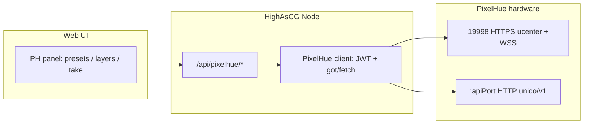

# Work order: PixelHue API in HighAsCG — Caspar + PixelHue layer mixing in the web UI

## Purpose

Bring **PixelHue** (Unico) control into **HighAsCG** so operators can **mix and program** using:

- **CasparCG** program/preview and layer stacks (existing HighAsCG flow), and  
- **PixelHue** layers, show presets, inputs, and take/cut — **from the same web UI**,

without constantly switching to PixelHue’s native UI or Companion-only surfaces.

**Source of API truth:** `docs/PIXELHUE_API.md` (extracted from `companion-module-pixelhue-switcher-main 2/`).  
**Related vision doc:** `work/WO_pixelhue-companion-and-tandem-looks.md` (tandem looks, RTSP, key+fill — may overlap; this WO focuses on **web UI + server proxy**).

---

## 1. Goals (what “done” looks like)

1. **Settings**  
   - Configure PixelHue **host**, discovery/TLS behavior, and optional **default screen** (ids from `screen/list-detail`).  
   - Optional: per-environment **read-only** mode (list presets/layers, no take).

2. **Server (Node)**  
   - **JWT** + HTTP client mirroring `ApiClient` (discovery → `open-detail` → sign token → call `/unico/v1/...`).  
   - **REST proxy** under e.g. `GET/POST/PUT /api/pixelhue/...` so the **browser never stores** the JWT.

3. **Web UI — “PixelHue” surface** (minimal v1)  
   - **Connection status** (ok / auth error / unreachable).  
   - **Read-only** lists: **show presets**, **layers** (with `selected`, `window`, `source` summary), **inputs/interfaces**.  
   - **Actions** (gated by permission/confirm): **Load preset to PVW** / **PGM**, **Take**, **Cut**, **select layer**, **set input on layer** (choose interface), **apply PH layer style preset** (see naming in `PIXELHUE_API.md`).

4. **Mixing story (v1 scope)**  
   - User can **place Caspar and PixelHue side-by-side in workflow**: e.g. Scenes / Looks for Caspar, right-hand or second tab for **PH control**.  
   - **v1 does not** require a single combined timeline; **v2+** can add **tandem** (one button → Caspar + PH).

5. **Observability**  
   - Log proxy errors with **no secrets** (truncate token in logs).  
   - Optional: expose last error in `GET /api/state` for Companion (`pixelhue: { connected, lastError }`).

---

## 2. Non-goals (explicit)

- **Full** replication of the Companion module (all feedbacks, every model variant) — start with one **MachineConfig** (e.g. **PF** or the device you have on the bench).  
- **Frame-accurate** lockstep with Caspar in v1.  
- **NDI/RTSP ingest** of PixelHue buses into go2rtc — covered as **Phase B** in `WO_pixelhue-companion-and-tandem-looks.md`, not required here.  
- Shipping **companion module** changes — treat the folder as **reference** only unless a bug is found.

---

## 3. Architecture

- **State:** Prefer **stateless** proxy per request, or a **small singleton** in `appCtx` that refreshes the JWT when `open-detail` changes (TBD: token expiry; module assumes stable session during Companion run).  
- **WebSocket from Node (optional P2):** subscribe to `wss://.../ucenter/ws` and forward a **simplified** JSON feed to the browser over existing HighAsCG **WS** — avoids polling `list-detail` for layer selection. **v1: HTTP poll only** is acceptable.

---

## 4. Phases and tasks

### Phase A — Config + health (foundation)

| Task | Detail |
|------|--------|
| A1 | Add `config.pixelhue` in `config/default.js` (or `highascg.config.example.json`): `enabled`, `host`, `httpsRejectUnauthorized`, optional `modelKey` / `targetSn`, timeouts. |
| A2 | Document env vars in same style as other integrations (e.g. `PIXELHUE_HOST` override if needed). |
| A3 | Implement `src/pixelhue/discovery.js` (wrap `device-list` on `:19998`). |
| A4 | Implement `open-detail` + `generateToken` (port from `companion` `src/utils/utils.ts` — **verify license**: jwt dependency already in `package.json` or add). |
| A5 | `GET /api/pixelhue/status` — `{ ok, devices?, apiPort?, model?, lastError? }` without leaking token. |

**Exit:** With hardware on LAN, `GET` returns `ok: true` and model/port discovered.

### Phase B — Read-only data for UI

| Task | Detail |
|------|--------|
| B1 | `GET /api/pixelhue/screens` → proxy `GET .../screen/list-detail`. |
| B2 | `GET /api/pixelhue/presets` → `GET .../preset`. |
| B3 | `GET /api/pixelhue/layers` → `GET .../layers/list-detail`. |
| B4 | `GET /api/pixelhue/layer-presets` → `GET .../layers/layer-preset/list-detail` (name: “PH layer style list” in UI). |
| B5 | `GET /api/pixelhue/interfaces` → `GET .../interface/list-detail`. |

**Exit:** Web UI can render tables from live data.

### Phase C — Mutating operations (with confirm in UI)

| Task | Detail |
|------|--------|
| C1 | `POST /api/pixelhue/preset/apply` — body: `{ presetId, serial, targetRegion }` (map `preview` → `4`, `program` → `2`). |
| C2 | `PUT /api/pixelhue/take` — body: list of `screen` ids or guids; server maps to full `take` body like `ApiClient.take`. |
| C3 | `PUT /api/pixelhue/cut` — same pattern as module. |
| C4 | `PUT /api/pixelhue/screen/select` — layer select (array of `{ layerId, selected }`). |
| C5 | `PUT /api/pixelhue/layers/source` — assign **interface** to **layer** (for mixing external feeds with Caspar in the show). |
| C6 | `PUT /api/pixelhue/layers/window` — bounds (for “layout” alignment with multiview or Caspar dimensions — document coordinate system). |
| C7 | `PUT /api/pixelhue/layers/layer-preset/apply` — PH **layer style** apply. |

**Exit:** All actions can be driven from a **dev** or **admin-gated** page.

### Phase D — Web UI (operator-facing)

| Task | Detail |
|------|--------|
| D1 | New **workspace tab** or **right-panel mode** “PixelHue” (or sub-tab under a “Mix” parent) — follow existing `panel` / `workspace__tabs` patterns. |
| D2 | **Status strip**: host, model, last sync time. |
| D3 | **Show presets** grid/list + **Load to PVW** / **Load to PGM** (with `targetRegion` from `LoadIn` constants). |
| D4 | **Layer list** with selection + **Input** dropdown (from interfaces) + **Apply style** (from PH layer style list). |
| D5 | **Take** / **Cut** buttons (choose **screen** when multi-screen). |
| D6 | Use existing **toast** + **connection eye** pattern for errors. |
| D7 | Optional: add link in **Settings** modal → “PixelHue” for host + enable. |

**Exit:** Operator can run a show segment **only** from HighAsCG for both Caspar and PH routes used in the plan.

### Phase E — Caspar + PixelHue in one mental model (v1.5)

| Task | Detail |
|------|--------|
| E1 | **Documentation** in `docs/`: e.g. “When to drive PGM from Caspar vs PixelHue” and **signal flow** (Caspar → SDI/NDI into PH input, etc.). |
| E2 | **Tandem (optional follow-up):** add `tandem.pixelhue` to look preset JSON and **orchestrate** call order (see `WO_pixelhue-companion-and-tandem-looks.md` §2.2). **Not blocking** Phases A–D. |
| E3 | **Keyboard shortcuts** or **Stream Deck**-friendly: expose the same mutating routes for Companion HTTP module to call HighAsCG (which proxies to PH). |

---

## 5. API route sketch (this repo)

All under **`/api/pixelhue`** (names subject to your router style):

- `GET /api/pixelhue/status`  
- `GET /api/pixelhue/screens`  
- `GET /api/pixelhue/presets`  
- `GET /api/pixelhue/layers`  
- `GET /api/pixelhue/layer-style-presets`  ← maps to PH `layer-preset/list-detail`  
- `GET /api/pixelhue/interfaces`  
- `POST /api/pixelhue/preset/apply`  
- `PUT /api/pixelhue/take`  
- `PUT /api/pixelhue/cut`  
- `PUT /api/pixelhue/layers/select`  
- `PUT /api/pixelhue/layers/source`  
- `PUT /api/pixelhue/layers/window`  
- `PUT /api/pixelhue/layer-style/apply`  ← PH layer style

Lock down with same **auth** as other sensitive routes if the server has admin middleware.

---

## 6. Testing

| Test | How |
|------|-----|
| Unit | Mock `open-detail` + JWT; assert path construction for **PF** endpoints. |
| Integration | On bench hardware: run `tools/http-smoke`-style check for `GET /api/pixelhue/status` after config. |
| Manual | From UI: load preset to PVW, take, cut, reassign input on a layer. |

---

## 7. Risks

- **Model drift:** P80 paths may differ from PF — feature-detect 404 and surface in `status`.  
- **Token lifetime:** if PixelHue revokes or rotates, **refresh** from `open-detail` on 401.  
- **Network:** `device-list` on `19998` must be reachable; corporate firewalls often block mDNS/HTTPS to devices — document **same-L3** requirement.

---

## 8. Checklist (sign-off)

- [ ] `docs/PIXELHUE_API.md` kept in sync with any endpoint change from vendor.  
- [ ] `config` example + README snippet for PixelHue.  
- [ ] No JWT or serial in client bundle or public logs.  
- [ ] UI strings distinguish **PH show preset** vs **PH layer style** vs **HighAsCG look**.  
- [ ] Tandem / RTSP follow-ups explicitly deferred or linked to the other WO.

*Version: 1.0 — 2026-04-23*
