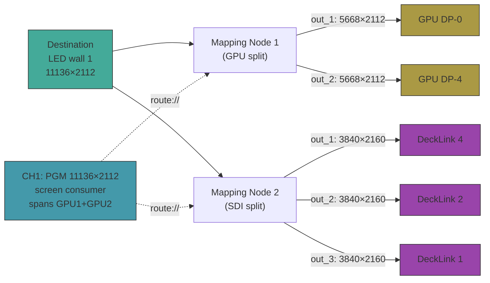

# HighAsCG Full Audit Report

## 1. Files Over 500 Lines

| Lines | File |
|-------|------|
| 637 | [sources-panel-helpers.js](file:///opt/highascg/web/components/sources-panel-helpers.js) |
| 578 | [pip-overlay.js](file:///opt/highascg/src/engine/pip-overlay.js) |
| 563 | [os-config.js](file:///opt/highascg/src/utils/os-config.js) |
| 554 | [preview-canvas-draw-stacks.js](file:///opt/highascg/web/components/preview-canvas-draw-stacks.js) |
| 519 | [scenes-compose.js](file:///opt/highascg/web/components/scenes-compose.js) |
| 513 | [system-settings.js](file:///opt/highascg/web/components/system-settings.js) |
| 512 | [timeline-editor-handlers.js](file:///opt/highascg/web/components/timeline-editor-handlers.js) |
| 505 | [defaults.js](file:///opt/highascg/src/config/defaults.js) |
| 504 | [header-bar.js](file:///opt/highascg/web/components/header-bar.js) |

> [!NOTE]
> 9 files exceed 500 lines. The worst offender is `sources-panel-helpers.js` at 637.
> `os-config.js` (563 lines) is the most critical one — it handles layout positioning for screen consumers.

---

## 2. Critical Config Generation Bugs

### Expected vs Actual Config

Your setup:
- **Destination**: `LED wall 1` → 11136×2112 @ 50fps
- **Mapping Node 1** (GPU split): 2 outputs → `out_1` (5668×2112), `out_2` (5668×2112) → GPU connectors
- **Mapping Node 2** (SDI split): 3 outputs → `out_1`, `out_2`, `out_3` → 3 DeckLinks @ **2160p50**
- **Screen consumer**: single 11136×2112 window spanning both GPU outputs

What you got:
- ❌ 64×64 ghost channels (channels 9-10)
- ❌ DeckLink channels at 1080p5000 instead of 2160p5000
- ❌ Screen consumer #2 starts at x=5668 (middle of first)
- ❌ No single spanning 11136×2112 screen window
- ❌ Screen consumers at 1920×1080 instead of slice dimensions

---

### Bug 1: 64×64 Ghost Channels

> [!CAUTION]
> **Root cause**: Mapping Node 2 (SDI) has all 3 slices with `"targetId": "out_1"` in device_graph.json.
> `out_2` and `out_3` have NO matching slices.

**Code path** in [build-caspar-generator-config.js:246-273](file:///opt/highascg/src/config/build-caspar-generator-config.js#L246-L273):

```javascript
const slice = slices.find(s => String(s.targetId || '').trim() === String(outId || '').trim())
const rect = slice?.rect || outputSettings?.rect
const w = Math.max(64, parseInt(String(rect?.w || 0), 10) || 0)
const h = Math.max(64, parseInt(String(rect?.h || 0), 10) || 0)
```

When no slice matches `out_2`/`out_3`, `rect` is `undefined`, so `w` and `h` both resolve to `Math.max(64, 0)` = **64**.

This creates the `64x64` custom video mode and those phantom channels.

**Fix needed**: Two parts:
1. **Data fix**: The 3 slices in Mapping Node 2 should target `out_1`, `out_2`, `out_3` respectively (currently all target `out_1`)
2. **Code fix**: When no slice matches AND no rect exists on outputSettings, fall through to the output's mode (e.g. `2160p5000`) rather than creating a 64×64 channel. The `Math.max(64, ...)` floor is too low and silently creates garbage.

---

### Bug 2: DeckLink Outputs at 1080p Instead of 2160p

> [!WARNING]
> **Root cause**: The mapping node output settings have `"mode": "1080p5000"` hardcoded per output.

In [device_graph.json:15-30](file:///opt/highascg/config/device_graph.json#L15-L30):
```json
"outputs": [
  { "id": "out_1", "mode": "1080p5000" },
  { "id": "out_2", "mode": "1080p5000" },
  { "id": "out_3", "mode": "1080p5000" }
]
```

The code at [build-caspar-generator-config.js:230](file:///opt/highascg/src/config/build-caspar-generator-config.js#L230):
```javascript
const modeRaw = String(outputSettings?.mode || outputSettings?.videoMode || '1080p5000').trim()
```

For the DeckLink sink path (`isDecklinkSink` at line 242):
```javascript
if (STANDARD_VIDEO_MODES[mode]) {
    merged[`screen_${n}_mode`] = mode  // sets to "1080p5000"!
}
```

**It uses the node's output mode setting, NOT the slice dimensions.** The slice says 3840×2160 but the output says `1080p5000`, and for DeckLink sinks the standard mode wins.

**Fix needed**: For DeckLink sinks, the code should check if the slice dimensions match a standard SMPTE mode (3840×2160 @ 50 = `2160p5000`) and use that instead of blindly trusting the node output `mode` field.

---

### Bug 3: Screen Consumer Positioning — Wrong X Offsets

> [!WARNING]
> **Root cause**: The main PGM channel gets a single screen consumer at the full 11136×2112 resolution, 
> but the mapping output channels also create their OWN screen consumers that overlap.

In your config:
- Channel 1: `11136x2112` screen at x=0 ✅ (the main PGM)
- Channel 3: `1080p5000` screen at **x=5668** ❌ (should be mapping output, not at x=5668)  
- Channel 4: `1080p5000` screen at x=11336 
- Channel 5: `1080p5000` screen at x=13256

The mapping output channels (for GPU outputs) should NOT have their own `<screen>` consumers because the **main PGM channel already renders the full 11136×2112**. The GPU mapping outputs need `decklink_replace_screen = true` equivalent behavior — they feed route:// + MIXER FILL, not separate screen windows.

But the code at [config-generator-channels.js:84-93](file:///opt/highascg/src/config/config-generator-channels.js#L84-L93) creates screen consumers for every mapping output unless `decklink_replace_screen` is true, and that flag is only set for DeckLink sinks.

**The fundamental design issue**: When a mapping node splits a destination to GPU outputs, those GPU channels should NOT create screen consumers. The main PGM channel's single screen consumer (spanning across physical GPU heads via OS layout) is the correct approach. The mapping channels should be screen-less route-only channels.

---

### Bug 4: No Single Spanning Screen Window

The user wants ONE 11136×2112 window stretched across two GPU outputs. This is correctly generated as Channel 1 with the full resolution. **However**, the mapping node outputs (channels for GPU) are also creating redundant screen windows with wrong dimensions (1080p instead of 5668×2112).

The correct architecture:
1. Channel 1 (PGM): 11136×2112 with screen consumer spanning both GPUs ✅ (this exists)
2. Mapping GPU channels: **no screen consumers** — only route:// sources with MIXER FILL
3. Mapping DeckLink channels: DeckLink consumer only, no screen, at 2160p5000

---

### Bug 5: Slice → Output Targeting Mismatch in Data

In [device_graph.json](file:///opt/highascg/config/device_graph.json), Mapping Node 2 (`mapping_moq9f061_1`):

```json
"mappings": [
  { "label": "sdi2", "rect": { "x": 3840, "y": 0, "w": 3840, "h": 2160 }, "targetId": "out_1" },
  { "label": "sdi1", "rect": { "x": 0,    "y": 0, "w": 3840, "h": 2160 }, "targetId": "out_1" },
  { "label": "sdi3", "rect": { "x": 7680, "y": 0, "w": 3840, "h": 2160 }, "targetId": "out_1" }
]
```

**All three slices target `out_1`!** `out_2` and `out_3` have no assigned slices. This is why:
- `out_1` picks up one slice (the first match) → gets 3840×2160 → but mode says 1080p
- `out_2` has no slice → falls to 64×64
- `out_3` has no slice → falls to 64×64

**Fix**: Each slice should target its corresponding output: `sdi1`→`out_1`, `sdi2`→`out_2`, `sdi3`→`out_3`.

---

## 3. Summary of Required Code Fixes

### Fix A: Prevent 64×64 fallback for mapping outputs without slices

In [build-caspar-generator-config.js:257-258](file:///opt/highascg/src/config/build-caspar-generator-config.js#L257-L258):

```diff
-const w = Math.max(64, parseInt(String(rect?.w || 0), 10) || 0)
-const h = Math.max(64, parseInt(String(rect?.h || 0), 10) || 0)
+const w = parseInt(String(rect?.w || 0), 10) || 0
+const h = parseInt(String(rect?.h || 0), 10) || 0
```

And add a guard: if `w === 0 || h === 0`, fall through to the output's mode or skip creating a custom mode.

### Fix B: DeckLink sink should derive mode from slice dimensions

When `isDecklinkSink` and a slice with 3840×2160 exists, find the matching standard mode (`2160p5000`) instead of using the node output `mode` field.

### Fix C: GPU mapping outputs should not create screen consumers

When the sink is a GPU output AND the source destination already has a main PGM screen consumer, the mapping channel should suppress its screen consumer (similar to `decklink_replace_screen`).

### Fix D: Data — Fix slice targetIds

The UI should enforce unique `targetId` per slice when multiple outputs exist, or the config builder should auto-distribute slices to outputs by index when all share the same targetId.

---

## 4. Architecture Diagram



**Expected channels:**
| Ch | Mode | Consumer | Purpose |
|----|------|----------|---------|
| 1 | 11136×2112 | screen (x=0, w=11136) | Main PGM |
| 2 | 11136×2112 | none | Preview |
| 3 | 1080p5000 | screen (MV1) | Multiview 1 |
| 4 | 1080p5000 | screen (MV2) | Multiview 2 |
| 5 | 5668×2112 | **none** (GPU route-only) | Mapping GPU out_1 |
| 6 | 5668×2112 | **none** (GPU route-only) | Mapping GPU out_2 |
| 7 | 2160p5000 | decklink dev=4 | Mapping SDI out_1 |
| 8 | 2160p5000 | decklink dev=2 | Mapping SDI out_2 |
| 9 | 2160p5000 | decklink dev=1 | Mapping SDI out_3 |
